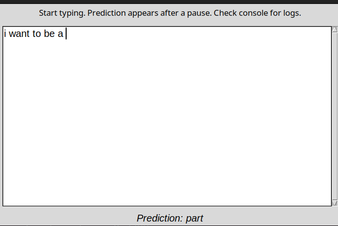

# GPT-2 Interactive Next Word Predictor

This Python script provides an interactive desktop application where users can type text, and after a short pause, the application predicts the next word they might type using a pre-trained GPT-2 model.



## Features

*   **Interactive Text Input:** A simple Tkinter-based GUI allows users to type freely.
*   **Real-time (Delayed) Prediction:** After the user stops typing for a configurable delay, the application predicts the next word.
*   **GPT-2 Powered:** Leverages the power of Hugging Face's `transformers` library to use the GPT-2 language model for predictions.
*   **Configurable Model:** Easily switch between different GPT-2 model sizes (e.g., `gpt2`, `gpt2-medium`).
*   **CPU/GPU Support:** Automatically utilizes a GPU (NVIDIA CUDA) if available and PyTorch is installed with CUDA support, otherwise falls back to CPU.
*   **Debounced Predictions:** Prevents excessive model calls while the user is actively typing.
*   **Context Window Optimization:** Uses only the last N tokens of the input to keep predictions relatively fast.

## Prerequisites

*   Python 3.7+
*   `pip` (Python package installer)
*   `tkinter` (usually included with Python, but on Linux, you might need to install it separately)

## Setup and Installation

1.  **Clone the Repository:**
    ```bash
    git clone https://github.com/your-username/your-repo-name.git
    cd your-repo-name
    ```

2.  **Create and Activate a Virtual Environment (Recommended):**
    *   **Linux/macOS:**
        ```bash
        python3 -m venv venv
        source venv/bin/activate
        ```
    *   **Windows (Git Bash or WSL):**
        ```bash
        python -m venv venv
        source venv/Scripts/activate
        ```
    *   **Windows (Command Prompt):**
        ```bash
        python -m venv venv
        .\venv\Scripts\activate
        ```

3.  **Install System Dependencies (for Tkinter on some Linux systems):**
    ```bash
    # For Debian/Ubuntu based systems
    sudo apt update
    sudo apt install python3-tk -y
    ```
    (Other Linux distributions might have different package names, e.g., `python3-tkinter` on Fedora.)

4.  **Install Python Libraries:**
    Install `transformers` and `torch` (PyTorch).

    *   **For CPU-only PyTorch (recommended for simplicity if you don't have an NVIDIA GPU or don't want to set up CUDA):**
        ```bash
        pip install transformers
        pip install torch torchvision torchaudio --index-url https://download.pytorch.org/whl/cpu
        ```

    *   **For PyTorch with CUDA support (if you have an NVIDIA GPU and want faster performance):**
        First, ensure you have NVIDIA drivers and the CUDA Toolkit installed. Then, visit the [PyTorch Get Started page](https://pytorch.org/get-started/locally/) to find the correct `pip install torch` command for your specific CUDA version.
        For example, for CUDA 11.8:
        ```bash
        pip install transformers
        pip install torch torchvision torchaudio --index-url https://download.pytorch.org/whl/cu118
        ```
        Or for CUDA 12.1:
        ```bash
        pip install transformers
        pip install torch torchvision torchaudio --index-url https://download.pytorch.org/whl/cu121
        ```
        *(Adjust the PyTorch command based on your CUDA version and the PyTorch website's recommendation.)*

## Running the Application

Execute the main Python script:

```bash
python your_script_name.py
